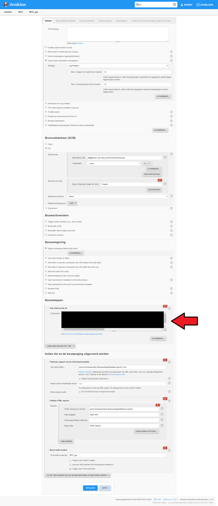

Dit is het testautomatiseringsproject van [Specialisterren](https://www.specialisterren.nl/) voor [de testomgeving van NPO POMS](https://poms-test.omroep.nl/). Het project maakt gebruik van [HSAC](https://github.com/fhoeben/hsac-fitnesse-fixtures/) in [FitNesse](http://fitnesse.org/).

## Properties files

Om de testscripts lokaal of in Jenkins te kunnen draaien, moeten er properties files aanwezig zijn waarin alle accounts en api-keys staan.

* Optie 1: Zet 1 properties file `poms-fitnesse-accounts.properties` met daarin alle accounts en api-keys in `~/conf` (Linux/macOS) of `%userprofile%\conf` (Windows).

* Optie 2: Maak een map `fileFixture` aan in [wiki/FitNesseRoot/files](wiki/FitNesseRoot/files) als deze nog niet bestaat en zet daarin deze properties files:

  * accounts.txt
  * apiKeys.txt

De properties files worden apart geleverd door Specialisterren.

## Lokaal draaien

Om toegang te krijgen tot de geautomatiseerde scripts in FitNesse, moet `start.bat` (of `start.sh`) uitgevoerd worden, dat in [/poms-functional-tests-fitnesse](/poms-functional-tests-fitnesse) staat. Dan verschijnt er een opdrachtprompt. Wacht tot er staat: `Starting FitNesse on port: 9090`. 

De FitNesse-omgeving kan dan bekeken worden door te browsen naar: [http://localhost:9090/NpoPoms](http://localhost:9090/NpoPoms).

De testscripts van de testomgeving staan in: [http://localhost:9090/NpoPoms.Omgevingen.Test.TestScripts](http://localhost:9090/NpoPoms.Omgevingen.Test.TestScripts).

De testscripts maken gebruik van scenario's in de scenario library. Die staan hier: [http://localhost:9090/NpoPoms.ScenarioLibrary](http://localhost:9090/NpoPoms.ScenarioLibrary).

## Draaien in Jenkins

In Jenkins moeten er 2 projecten komen:

* NPO_api
* NPO_gui

### NPO_api

De configuratie van `NPO_api` moet als volgt worden ingesteld:



Als de properties files in `~/conf` (Linux/macOS) of `%userprofile%\conf` (Windows) zitten, dan moet er dit bij `Commando` staan:
```
cd poms-functional-tests-fitnesse
MOZ_HEADLESS=1
mvn clean test-compile failsafe:integration-test -DfitnesseSuiteToRun=NpoPoms.Omgevingen.Test.TestScripts.Api
```

Als dit niet zo is, dan moet deze properties file `apiKeys.txt` gegenereerd worden via `Commando`:
```
frontEndApiKey=apiKey
frontEndApiSecret=secret
frontEndApiOrigin=https://poms.testomgeving.example.com/
```

Dit moet er dan bij `Commando` staan:

```
cd poms-functional-tests-fitnesse
mvn clean test-compile
mkdir -p target/fitnesse-results/files/fileFixture

(echo frontEndApiKey=apiKey & echo frontEndApiSecret=secret & echo frontEndApiOrigin=https://poms.testomgeving.example.com/) > target/fitnesse-results/files/fileFixture/apiKeys.txt

mvn failsafe:integration-test -DfitnesseSuiteToRun=NpoPoms.Omgevingen.Test.TestScripts.Api "-DseleniumJsonProfile={'args':['headless','disable-gpu']}"
```

De waarden achter `=` moeten vervangen worden door de werkelijke waarden.

### NPO_gui

De configuratie van `NPO_gui` moet ingesteld worden zoals `NPO_api`, maar zonder de laatste actie `Bouw ander project` en er komen andere commando's in `Commando`.

Als de properties files in `~/conf` (Linux/macOS) of `%userprofile%\conf` (Windows) zitten, dan moet er dit bij `Commando` staan:
```
cd poms-functional-tests-fitnesse
MOZ_HEADLESS=1
mvn clean test-compile failsafe:integration-test -DfitnesseSuiteToRun=NpoPoms.Omgevingen.Test.TestScripts.Gui
```

Als dit niet zo is, dan moet deze properties file `accounts.txt` gegenereerd worden via `Commando`:
```
standaardGebruikersnaam=gebruikersnaam
standaardWachtwoord=wachtwoord
npoGebruikersnaam=gebruikersnaam
npoWachtwoord=wachtwoord
adminGebruikersnaam=gebruikersnaam
adminWachtwoord=wachtwoord
omroepUploaderGebruikersnaam=gebruikersnaam
omroepUploaderWachtwoord=wachtwoord
```

Dit moet er dan bij `Commando` staan:

```
cd poms-functional-tests-fitnesse
mvn clean test-compile
mkdir -p target/fitnesse-results/files/fileFixture

(echo standaardGebruikersnaam=gebruikersnaam & echo standaardWachtwoord=wachtwoord & echo npoGebruikersnaam=gebruikersnaam & echo npoWachtwoord=wachtwoord & echo adminGebruikersnaam=gebruikersnaam & echo adminWachtwoord=wachtwoord & echo omroepUploaderGebruikersnaam=gebruikersnaam & echo omroepUploaderWachtwoord=wachtwoord) > target/fitnesse-results/files/fileFixture/accounts.txt

mvn failsafe:integration-test -DfitnesseSuiteToRun=NpoPoms.Omgevingen.Test.TestScripts.Gui "-DseleniumJsonProfile={'args':['headless','disable-gpu']}"
```

De waarden achter `=` moeten vervangen worden door de werkelijke waarden.
